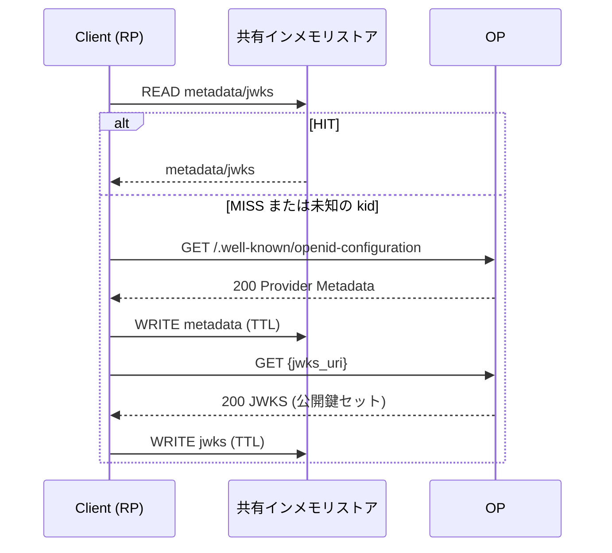
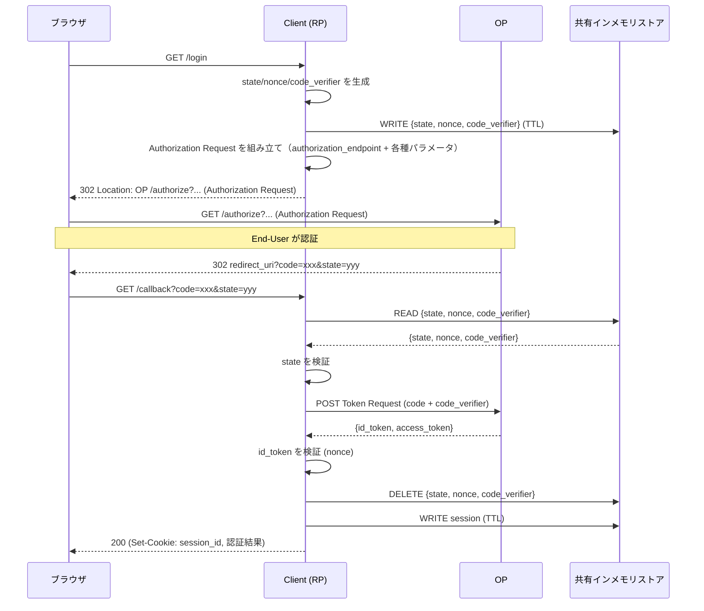

# System Architecture

## 登場者

| 登場者 | 説明 | 仕様上の呼び名 |
|--------|------|----------------|
| ブラウザ | End-Userが操作するUAO | User Agent |
| このClient | 認証を要求するアプリ | Relying Party (RP) |
| OpenID Provider | 認証を行うサーバー | OpenID Provider (OP) |
| 共有インメモリストア | 認可トランザクション（state/nonce）とDiscovery（メタデータ/JWKS）を共有・TTL付きで管理するストレージ（例: Redis） | Shared Store |

## フロー
### 起動時/初回利用時: OIDC Discovery（メタデータ/JWKSの取得）

Discovery は OP のエンドポイント情報や検証用鍵の取得先を確定するための処理であり、毎回OPへ取りに行くと遅延要因になる。
一方で、インスタンスごとにキャッシュを持つと整合性・運用管理コストが上がるため、共有インメモリストアにキャッシュし、TTLで更新する。

補足:

- 未知の kid については [shared-store.md](shared-store.md) を参照

### 認可コードフロー（/login → OP → /callback）と共有インメモリストア

## 共有インメモリストアの仕様

共有インメモリストアの具体仕様は、下記を参照。

- [shared-store.md](shared-store.md)

仕様参照: [OpenID Connect Discovery 1.0](https://openid.net/specs/openid-connect-discovery-1_0.html#ProviderMetadata)
